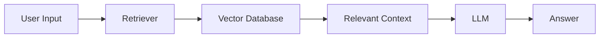

<div align="center">


</div>

---

<div align="center">


</div>

---

## 🧠 ABOUT ME

```python
class Shakeel:

    role = "AI / ML Student"
    focus = "RAG Systems + LLM Applications"
    location = "Tamil Nadu, India 🇮🇳"

    def current_goal(self):
        return "Learn by building real-world AI systems"

    def mindset(self):
        return "Consistency > Perfection"

    def philosophy(self):
        return "LLMs become useful when they know where to look."
```

---

## ⚡ CURRENTLY LEARNING / BUILDING

```diff
+ Retrieval-Augmented Generation (RAG)
+ Vector Databases & Semantic Search
+ FastAPI backend for ML systems
+ Deploying AI apps (Streamlit + Docker)
```

---

## 🧬 TECH STACK

<div align="center">


</div>

---

## 🚀 PROJECTS

### 🩺 CardioGuard

* Built a cardiovascular risk prediction system
* FastAPI backend + Flutter + Next.js frontend
* Uses ML model for risk classification
* Real-time data sync using Supabase

---

### 🎬 CineSync

* AI-powered Telegram movie bot
* Built using LangChain + n8n workflows
* Understands natural language queries

---

### 📚 BriefMind

* NLP-based document summarizer
* Helps reduce reading time significantly

---

### ⚖️ LexAI

* AI-based legal query assistant
* Integrated Gemini API with Streamlit

---

## 🧠 HOW I APPROACH AI SYSTEMS



---

## 📊 GITHUB STATS

<div align="center">


</div>

---

## 🌐 CONNECT

<div align="center">

[LinkedIn](https://linkedin.com/in/mohamed-shakeel-720b2a29b) •
[GitHub](https://github.com/shakeelscribes) •
[Email](mailto:ahamedshakeel2005@gmail.com)

</div>

---

## ⚡ FINAL NOTE

```diff
- Just learning AI
+ Building while learning AI
```

---

<div align="center">


</div>

<div align="center">


</div>
